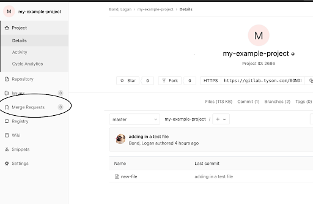
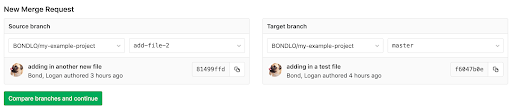
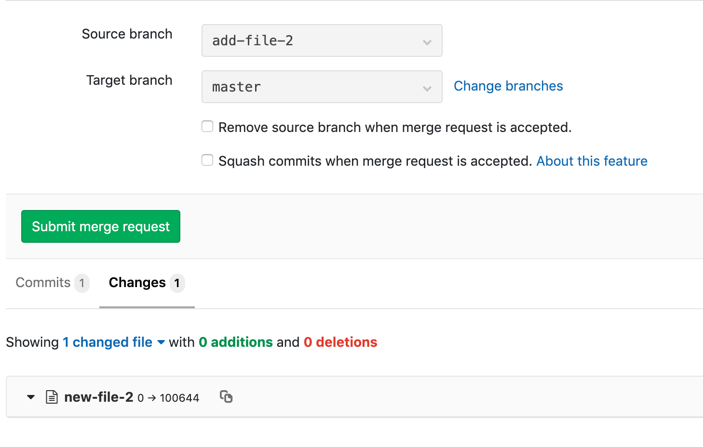

# We can now merge our branch into master, let's imagine that we are working over GitLab

## Task

First we need to request a merge.  
  

And then we need to chose our source and target branch.  
  

Once we click on continue we will see a merge request form where we can detail our changes, we need to be detailed, since here over the merge request that the code reviews takes place.

Here we can take a look over the changes, in this case we'll see the new file added.  
  
