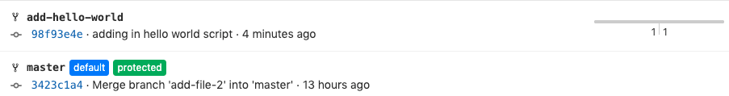

# Let’s add our new script to the stage, commit, and push our branch

## Task

`git add hello.rb`

`git commit -m 'adding in hello world script'`

`git push origin add-hello-world`

Origin has our new branch, this is how it looks in GitLab.  

