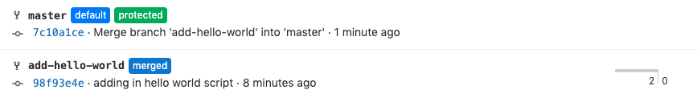

# Now we have an interesting scenario - add-hello-world branch shows as 1 | 1 (we are one commit behind and one commit ahead of master). Before we pushed our branch, we made sure we already had all of the same code origin/master did - new-file and new-file-2 - yet we are still behind by one commit. This scenario is where merge commits become noisy. **We are one commit behind master**, and that commit is the **merge commit that was automatically generated** when our merge request was approved and merged in

## Task

For sake of argument, let’s go ahead and create the merge request anyway to merge add-hello-world into master. Leave everything default and push it through - it will merge successfully since there are no merge conflicts. But now if we look at our branches again.  

The add-hello-world branch is now two commits behind master, even though they contain the same code in effect. This discrepancy is again due to master having two merge commits now that each merge automatically generated a commit.  
