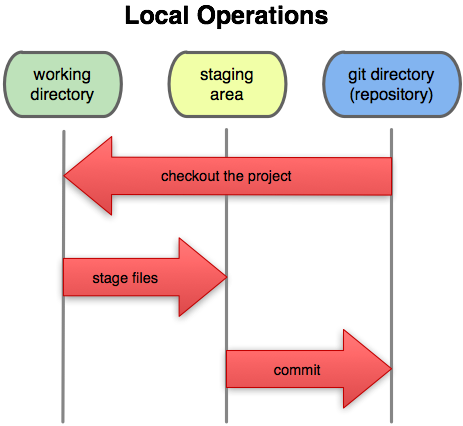

# Git uses a staging area to track files and changes before commit

  

## Task

We can stage our changes in order to commit them.  

`git add .`{{execute}}  

Git will show that our file is now staged.  

`git status`{{execute}}  
