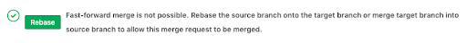

# Now let’s switch over to Developer 2, who we can pretend was tasked with deleting new-file-2 as it isn’t needed anymore

## Tasks

Once the merge gets done let's start.

We need to create our working space first.  

`mkdir -p /home/scrapbook/tutorial/git/my-local-2`{{execute}}  
`cd /home/scrapbook/tutorial/git/my-local-2`{{execute}}  

And now let's clone the previous project.  

`git clone /home/scrapbook/tutorial/git/my-remote/project && cd project`{{execute}}  

Now let's start working here.  

`git checkout -b remove-new-file-2`{{execute}}  

`rm new-file-2`{{execute}}  

`git add .`{{execute}}  

`git commit -m 'removing new-file-2 as it is no longer needed'`{{execute}}  

If we now take a look at our branches, we should see that remove-new-file-2 is 1 | 1 (one commit behind and one commit ahead of master). If we try to merge this now, GitLab will give us a nice error.  

  

There is a big “Rebase” button (don’t click it - there are problems with it in GitLab 11.2) indicating that we need to rebase before we can merge.  
